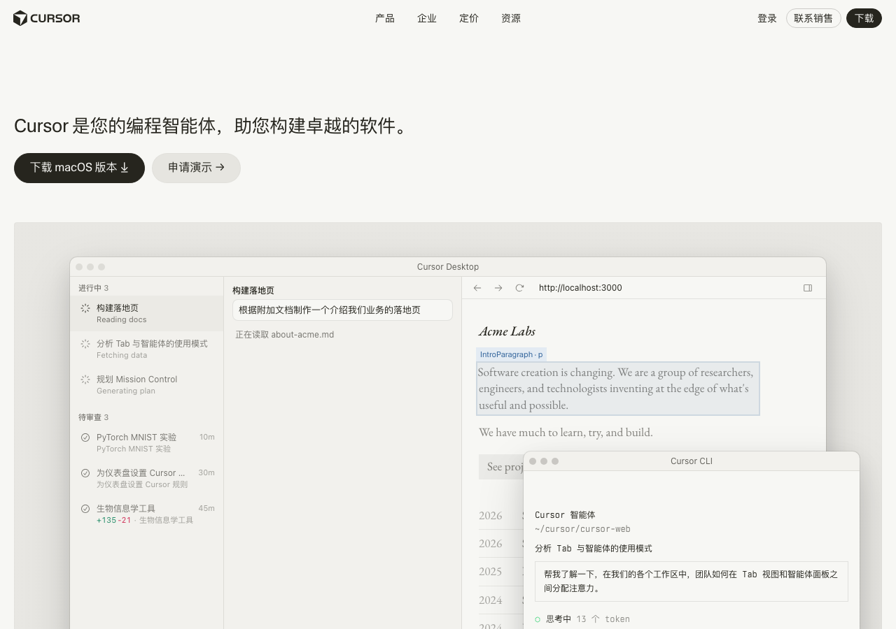
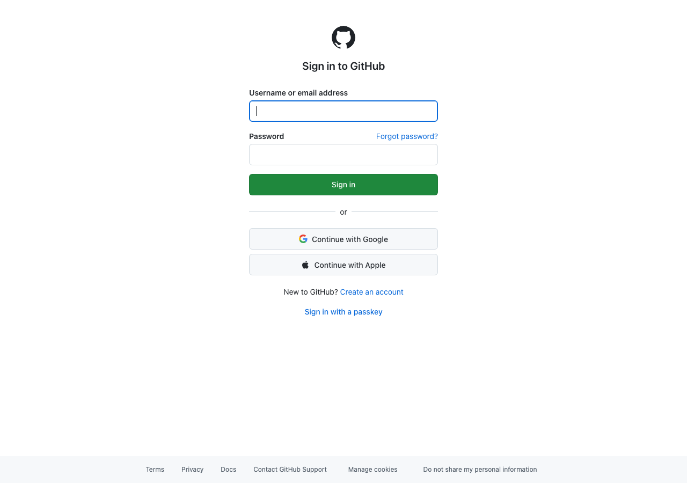
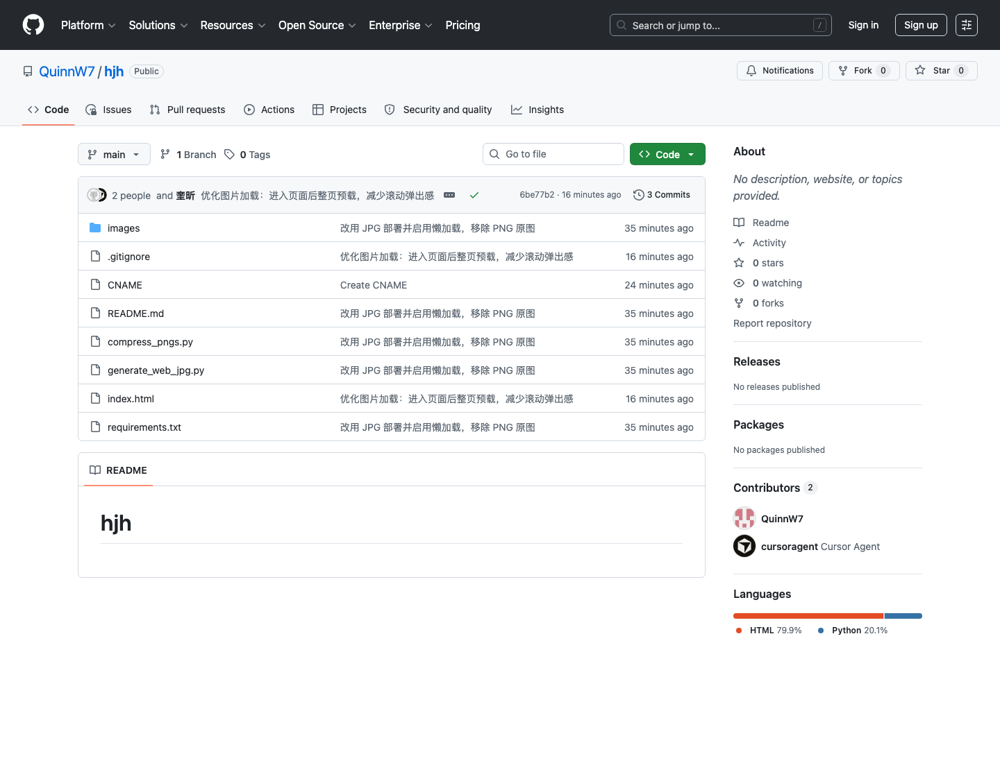

# 从零搭个人网站（超级傻瓜教程）

> 你不需要会写代码。  
> 只要会：开软件、复制粘贴、点按钮、对照截图。  
>  
> 成品例子：打开浏览器输入 [jiaho.cc](https://jiaho.cc)  
> 代码放在：[github.com/QuinnW7/hjh](https://github.com/QuinnW7/hjh)


---

## 先搞懂一件事（30 秒）

个人网站其实就是：

1. 电脑上有一个文件夹  
2. 里面有一个叫 `index.html` 的文件（网页正文）  
3. 还有一些图片  
4. 把这个文件夹上传到 GitHub  
5. GitHub 帮你变成网上能打开的网址  

就这么多。别的都可以边做边学。

---

## 开始前：准备这些东西

请先一项一项打勾：

- [ ] 电脑（Mac 或 Windows）
- [ ] 安装好 [Cursor](https://cursor.com)（一个带 AI 的代码编辑器）
- [ ] 注册好 [GitHub](https://github.com) 账号（像注册邮箱一样）
- [ ] （可选）已经在阿里云买好域名（本教程例子是 `jiaho.cc`）
- [ ] 准备好要放上网站的图片（先放在电脑任意文件夹也行）

### 📸 截图 01 · 准备工作

Cursor 官网长这样（去下载安装）：



GitHub 登录页长这样（没有账号就点 Create an account）：



> **待补（可选）：** 你自己桌面上 Cursor 图标的照片，放成 `教程截图/01-准备工作-桌面.png`

---

## 全程只有四步

```
第 1 步  用 Cursor 写出网页骨架（index.html）
第 2 步  把图片放进项目的 images 文件夹
第 3 步  上传到 GitHub
第 4 步  打开网页上线，并绑上自己的域名
```

下面按顺序做。**每做完一步，先对照检查清单，对了再进下一步。**

---

# 第 1 步：用 Cursor 写出网站骨架

## 1-1 新建一个空文件夹

1. 在电脑上新建文件夹，名字随便，比如叫 `hjh`
2. 记住它在哪（例如「文档」里）

> **📸 截图 02 · 空文件夹（待补）**  
> 拍：Finder 里刚建好的空文件夹 `hjh`  
> 保存为：`教程截图/02-空文件夹.png`

## 1-2 用 Cursor 打开这个文件夹

1. 打开 Cursor
2. 点左上角 `File` → `Open Folder…`
3. 选中刚才的 `hjh`，打开

> **📸 截图 03 · Cursor 打开空项目（待补）**  
> 拍：Cursor 左侧文件栏几乎是空的  
> 保存为：`教程截图/03-Cursor空项目.png`

## 1-3 跟 AI 说话，让它写网页

1. 在 Cursor 里打开聊天（一般是右侧）
2. **原样复制**下面这段话发给它：

```text
请帮我做一个个人作品集网站。

要求：
1. 只生成一个 index.html 文件
2. 首页中间显示我的名字（先写「黄嘉虹」）
3. 有两个入口：一个叫「工作掠影」，一个叫「生活行旅」
4. 用简单的 HTML + CSS + JavaScript
5. 不要用复杂框架，不要 npm，不要需要安装一堆东西
6. 我之后会自己往里面加图片

先把能打开、能点击切换的骨架做出来就行。
```

3. 等它生成文件  
4. 如果它问你要不要创建 / 写入，选同意

> **📸 截图 04 · 对 AI 下指令（待补）** → `教程截图/04-对AI下指令.png`  
> **📸 截图 05 · 出现 index.html（待补）** → `教程截图/05-出现index.html.png`

## 1-4 在浏览器里打开看看

### 方法 A（最简单）

1. 找到文件夹里的 `index.html`
2. 双击它，用浏览器打开

### 方法 B（更稳一点）

1. 在 Cursor 底部打开终端
2. 复制粘贴，回车：

```bash
python3 -m http.server 8080
```

3. 浏览器打开：`http://localhost:8080`

### 📸 截图 06 · 本地第一次打开网站（已有）

成功时大概长这样——能看到名字 + 两个入口就行：


### ✅ 第 1 步检查清单

- [ ] 有 `index.html` 这个文件
- [ ] 浏览器能打开它
- [ ] 能看到名字和入口（哪怕还很简陋）

**没过关就不要急着进第 2 步。** 回去跟 AI 说：「浏览器打开是空白的 / 点不了，帮我修。」

---

# 第 2 步：把图片放进网站

## 2-1 建一个叫 images 的文件夹

在项目里新建文件夹，名字必须叫：

```text
images
```

然后在里面再按内容建小文件夹，例如：

```text
images/
  百瑞新封面/
  英沃特图片/
  魔女/
  人像摄影/
  ……
```

名字可以按你自己的作品改，**关键是：有序、好找。**

> **📸 截图 07 · images 文件夹结构（待补）** → `教程截图/07-images文件夹.png`  
> **📸 截图 08 · 图片已放进来（待补）** → `教程截图/08-图片已放入.png`

## 2-2 把图片拖进去

从你原来存照片的地方，**拖拽 / 复制**到对应子文件夹。

## 2-3 让网页真正显示这些图

跟 Cursor 说（可复制）：

```text
请把 images 文件夹里的图片接到网站对应页面上。
工作相关的图放到「工作掠影」，生活摄影放到「生活行旅」。
用相对路径，例如 ./images/魔女/文件名.jpg
```

改完后刷新浏览器看图有没有出来。

> **📸 截图 09 · 网页上能看到图（待补）** → `教程截图/09-网页已有图.png`

## 2-4 图片太大怎么办？（可先跳过）

- 网上用的图：尽量用 **JPG**
- 最长边大概 **1600 像素** 就够了
- **不要**把原始超大 PNG（几十 MB 一张）直接当网站图

本项目后来把约 **1.9GB** 原图压成约 **22MB** JPG，才好用。

> **📸 截图 10 · 体积对比（可选待补）** → `教程截图/10-图片体积对比.png`

### ✅ 第 2 步检查清单

- [ ] 有 `images` 文件夹
- [ ] 图片已经放进去了
- [ ] 浏览器刷新后，网页上能看到至少一部分图

---

# 第 3 步：上传到 GitHub

目标：让网站文件出现在 GitHub 上。  
可以想成：把电脑里的文件夹，复印一份到网上。

## 3-1 在 GitHub 网站上新建空仓库

1. 打开 [github.com](https://github.com)，登录
2. 右上角点 `+` → `New repository`
3. Repository name 填一个名字，比如 `hjh`
4. **重要：不要勾选** “Add a README file”
5. 点绿色按钮 `Create repository`

> **📸 截图 11 · New repository（待补）** → `教程截图/11-New-repository.png`  
> 请圈出：没有勾选 Add a README  
> **📸 截图 12 · 仓库创建成功（待补）** → `教程截图/12-仓库创建成功.png`

## 3-2 把本地项目推上去

在 Cursor 终端里（确认已在项目文件夹），一行一行执行：

```bash
git init
git add .
git commit -m "第一次上传个人网站"
git branch -M main
git remote add origin https://github.com/你的用户名/hjh.git
git push -u origin main
```

把地址里的「你的用户名 / 仓库名」换成你自己的。  
推送时可能会弹出登录窗口，按提示完成。

> **📸 截图 13 · 终端 push 成功（待补）** → `教程截图/13-push成功.png`

### 📸 截图 14 · GitHub 上已经有文件了（已有）

推送成功后，仓库页面大概长这样：



能看到 `index.html`、`images`、`CNAME` 等，就说明上传成功了。

### ✅ 第 3 步检查清单

- [ ] GitHub 上能看到你的仓库
- [ ] 仓库里有 `index.html`
- [ ] 仓库里有 `images`（或至少部分图片）

---

# 第 4 步：上线 + 绑域名

分两段：

- **A.** 先用 GitHub 免费网址打开（必须先做成）
- **B.** 再绑自己买的域名（比如 `jiaho.cc`）

---

## A. 打开 GitHub Pages（免费上线）

1. 打开你的仓库页面
2. 点 `Settings`（设置）
3. 左侧找到 `Pages`
4. Build and deployment：
   - Source：`Deploy from a branch`
   - Branch：`main`
   - 文件夹：`/ (root)`
5. 点 Save

等 1～3 分钟，会出现类似：

```text
https://你的用户名.github.io/hjh/
```

能打开 = 网站已经真正上线了。

> **📸 截图 15 · Pages 设置页（待补）** → `教程截图/15-Pages设置.png`  
> 请红框圈出：Source、Branch、Save  
> **📸 截图 16 · github.io 打开成功（待补）** → `教程截图/16-github-io打开成功.png`

### ✅ A 段检查清单

- [ ] Pages 已经 Save
- [ ] `xxx.github.io/...` 能打开你的站

**如果这一步都打不开，先别绑域名。**

---

## B. 绑定阿里云域名（可选，但很酷）

目标：别人直接输入 `jiaho.cc` 就能打开。

### B-1 加一个 CNAME 文件

项目根目录新建文件 `CNAME`，内容只有一行：

```text
jiaho.cc
```

然后：

```bash
git add CNAME
git commit -m "绑定自定义域名"
git push
```

也可在 GitHub：`Settings → Pages → Custom domain` 里直接填域名。

> **📸 截图 17 · CNAME 内容（待补）** → `教程截图/17-CNAME文件.png`  
> **📸 截图 18 · Custom domain（待补）** → `教程截图/18-Custom-domain.png`

### B-2 阿里云做域名解析

用人话讲：告诉全世界——访问 `jiaho.cc` 时，去找 GitHub。

1. 登录阿里云 → 域名 → 解析
2. 按表添加：

**根域名用 A 记录：**

| 记录类型 | 主机记录 | 记录值 |
|----------|----------|--------|
| A | `@` | `185.199.108.153` |
| A | `@` | `185.199.109.153` |
| A | `@` | `185.199.110.153` |
| A | `@` | `185.199.111.153` |

**www 用 CNAME：**

| 记录类型 | 主机记录 | 记录值 |
|----------|----------|--------|
| CNAME | `www` | `你的用户名.github.io` |

> IP 以 [GitHub 官方文档](https://docs.github.com/pages/configuring-a-custom-domain-for-your-github-pages-site) 为准。

> **📸 截图 19 · 阿里云解析列表（待补）** → `教程截图/19-阿里云解析.png`

### B-3 勾选 HTTPS

回到 `Settings → Pages`，等一会儿后勾选 `Enforce HTTPS`。  
DNS 有时要等一阵，别狂点。

> **📸 截图 20 · HTTPS 已勾选（待补）** → `教程截图/20-Enforce-HTTPS.png`

### B-4 最终验收

打开 `https://jiaho.cc`，能看到网站 = 完成。🎉

### 📸 截图 21 · 最终首页效果（已有）

首页效果如下（你自己再补一张地址栏带 `jiaho.cc` 的会更完美）：


### ✅ 第 4 步检查清单

- [ ] `github.io` 地址能打开
- [ ] 阿里云解析已添加
- [ ] GitHub 已填写自定义域名
- [ ] `https://你的域名` 能打开

---

# 以后怎么改网站？

```bash
git add .
git commit -m "更新了一点内容"
git push
```

等 1～2 分钟，刷新网页。

> **📸 截图 22 · 日常更新（可选待补）** → `教程截图/22-日常push.png`

---

# 常见卡住的地方

**浏览器空白** → 确认打开的是 `index.html`；或用 `python3 -m http.server 8080`；把报错发给 Cursor。

**图片不显示** → 检查路径 `./images/文件夹/文件名.jpg`；强制刷新 `Cmd + Shift + R`。

**git push 失败** → 多半没登录，或远程地址错了。用 `git remote -v` 检查。

**Pages 打不开** → 再等几分钟；确认 branch 是 `main`、目录是 `/ (root)`；仓库建议设为 Public。

**域名打不开** → 先确认 `github.io` 能开；再查阿里云解析；DNS 生效需要时间。

---

# 截图清单（哪些有了 / 哪些待补）

截图统一放在文件夹：[`教程截图/`](./教程截图/)

| 编号 | 内容 | 状态 |
|------|------|------|
| 01a / 01b | Cursor 官网 + GitHub 登录 | ✅ 已有 |
| 02 | 空文件夹 | ⏳ 待补 |
| 03 | Cursor 空项目 | ⏳ 待补 |
| 04 | 对 AI 下指令 | ⏳ 待补 |
| 05 | 出现 index.html | ⏳ 待补 |
| 06 | 本地预览 | ✅ 已有 |
| 07–10 | 图片相关 | ⏳ 待补 |
| 11–13 | 建仓 / push | ⏳ 待补 |
| 14 | GitHub 仓库文件 | ✅ 已有 |
| 15–20 | Pages / 域名 / 阿里云 | ⏳ 待补 |
| 21 | 最终首页效果 | ✅ 已有 |
| 22 | 日常 push | ⏳ 可选 |

### 你自己补图时

1. 按上面文件名保存进 `教程截图/`
2. 关键按钮用红框圈一下
3. 密码 / Token 打码

---

# 一句话复习

1. **Cursor** 写出 `index.html`  
2. **images** 放图，让网页显示出来  
3. **GitHub** 把文件传到网上  
4. **Pages + 域名解析** 让全世界用你的域名打开  

做完这四步，你就有一个真正属于自己的网站了。
